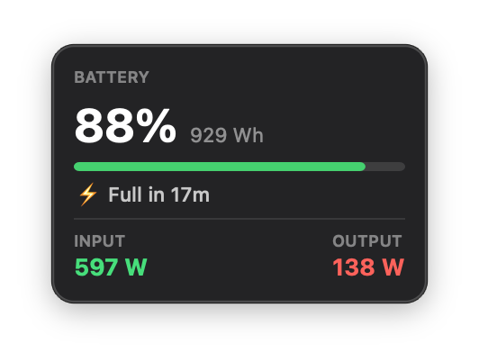

# EFStatus

A lightweight macOS menu bar app that shows real-time EcoFlow Delta 2 battery status — no phone app needed, no Node.js, no cloud subscriptions.



## What it shows

**Menu bar:** `⚡ 89%`

**Popup:**
- Battery % + remaining Wh + visual bar
- Time to full / time to empty
- Live input watts (green) and output watts (red)

## Requirements

- macOS 12 or later
- Xcode Command Line Tools (`xcode-select --install`)
- An [EcoFlow developer account](https://developer.ecoflow.com) with an API key

## Build & run

```bash
git clone https://github.com/bereto-dev/efstatus.git
cd efstatus
make
open EFStatus.app
```

The first launch opens a setup window where you enter your EcoFlow API credentials. They're saved in `UserDefaults` on your Mac — never sent anywhere other than the EcoFlow API.

## First launch security

Because the app isn't notarized (no Apple Developer account needed), macOS will block it the first time. Right-click → **Open** → **Open** to bypass Gatekeeper once.

## Credentials

Get your Access Key, Secret Key, and device serial number from [developer.ecoflow.com](https://developer.ecoflow.com).

To update credentials later: right-click the menu bar icon → **Settings…**

## Notifications

EFStatus sends a macOS notification when:
- Input power drops to 0 W (running on battery only)
- The device goes offline or comes back online

## Origin

Built by Roberto Pacheco because the EcoFlow Delta 2 doesn't surface consumption statistics in real time — and as his primary office backup power, he needed that data at a glance without picking up his phone.

## Support

If you find EFStatus useful, you can buy me a coffee ☕

[](https://buymeacoffee.com/bereto)

---

Built with Swift + AppKit. No external dependencies.
