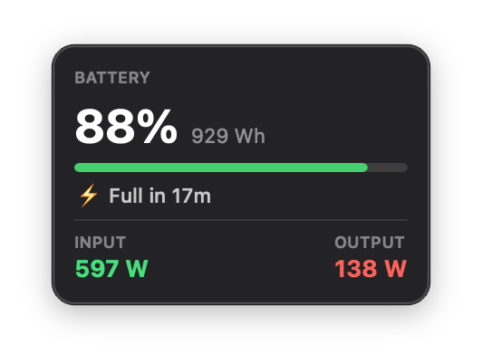

# EFStatus (v2.1.0)

A lightweight macOS menu bar app that shows real-time EcoFlow Delta 2 battery status — no phone app needed, no Node.js, no cloud subscriptions.



> Running an older version? Compare the number above to the one in **About EFStatus** (right-click the menu bar icon), then re-download `EFStatus.app` from this repo if you're behind.

## What it shows

**Menu bar:** `EF⚡ 89%`

**Popup:**
- Battery % + remaining Wh + visual bar
- Time to full / time to empty
- Live input watts (green) and output watts (red)
- Device model (DELTA 2 / DELTA 3)

## How it works

Starting with v2.0.0, EFStatus connects to EcoFlow's real-time MQTT feed — the same channel used by the official app. Data updates the moment your device reports a change, instead of polling every 10 seconds. If the MQTT connection drops, the app falls back to REST polling automatically and reconnects in the background.

## Compatibility

**Confirmed working**
- EcoFlow Delta 2 ✅ (tested)
- EcoFlow Delta 3 Max ✅ (tested)

**Likely compatible** (same API structure, untested)
- EcoFlow Delta 2 Max
- EcoFlow Delta Pro
- EcoFlow Delta Max
- Delta 3
- Delta Mini
- River 2 / River 2 Pro / River 2 Max
- River Pro

**Not supported**
- PowerOcean, PowerStream — different API
- Delta (1st gen), River (1st gen) — different field names

> If you test EFStatus on a model not listed here, open an issue and let us know!

## Requirements

- macOS 12 or later
- Xcode Command Line Tools (`xcode-select --install`)
- An [EcoFlow developer account](https://developer.ecoflow.com) with an API key

## Download & run (no build required)

1. Download `EFStatus.app` from this repo
2. Move it to your `/Applications` folder
3. Right-click → **Open** → **Open** (required once to bypass Gatekeeper on unsigned apps)
4. Enter your EcoFlow API credentials in the setup window

## Build from source

```bash
git clone https://github.com/bereto-dev/efstatus.git
cd efstatus
make
open EFStatus.app
```

The first launch opens a setup window where you enter your EcoFlow API credentials. They're saved in `UserDefaults` on your Mac — never sent anywhere other than the EcoFlow API.

## First launch security

Because the app isn't notarized (no Apple Developer account needed), macOS will block it the first time. Right-click → **Open** → **Open** to bypass Gatekeeper once.

## Credentials

Get your Access Key, Secret Key, and device serial number from [developer.ecoflow.com](https://developer.ecoflow.com).

To update credentials later: right-click the menu bar icon → **Settings…**

## Notifications

EFStatus sends a macOS notification when:
- Input power drops to 0 W (running on battery only)
- The device goes offline or comes back online

## Origin

Built by Roberto Pacheco because the EcoFlow Delta 2 doesn't surface consumption statistics in real time — and as his primary office backup power, he needed that data at a glance without picking up his phone.

## Help expand compatibility

If you have an EcoFlow device not listed above and want to help add support for it, run the diagnostic from the app: right-click the menu bar icon → **Copy Diagnostics**, then open a [GitHub issue](https://github.com/bereto-dev/efstatus/issues) and paste the output.

Or run it from the terminal:

```bash
curl -O https://raw.githubusercontent.com/bereto-dev/efstatus/main/diag.sh
chmod +x diag.sh
./diag.sh --access-key YOUR_KEY --secret-key YOUR_SECRET --serial YOUR_SERIAL
```

No credentials or personal data are included in the output.

## Changelog

### v2.1.0
- New app icon and status bar icon using SF Symbol `bolt.fill`

### v2.0.0
- **Real-time data via MQTT** — EFStatus now connects to EcoFlow's live data feed (the same one used by the official app). Values update the moment your device reports a change instead of every 10 seconds.
- **Automatic reconnection** — if the MQTT connection drops, the app silently falls back to polling and reconnects in the background.
- **Fixed input reading bug** — input watts are now read from the correct fields, preventing the app from showing stale non-zero values after the charger is disconnected.
- **Delta 3 Max support** — device is detected automatically; model name (DELTA 2 / DELTA 3) shown in the popup.

### v1.4.0
- Added "Copy Diagnostics" menu option
- Added refresh button in popup with spin animation
- Fixed popup positioning (4px gap, centered on status bar icon)
- Fixed 0W input bug for Delta 2 (solar vs AC field conflict)

### v1.3.0
- Added About window with origin story and support links
- Added "Check for Updates" menu option
- Added version badge to README

### v1.2.0
- Improved popup design (dark card, color-coded watts)
- Fixed Cmd+V paste in setup window

### v1.1.0
- Fixed SOC accuracy using `bms_emsStatus.lcdShowSoc`
- Fixed UserDefaults crash on first launch

### v1.0.0
- Initial release

## Support

If you find EFStatus useful, you can buy me a coffee ☕

[](https://buymeacoffee.com/bereto)

---

Built with Swift + AppKit. No external dependencies.
