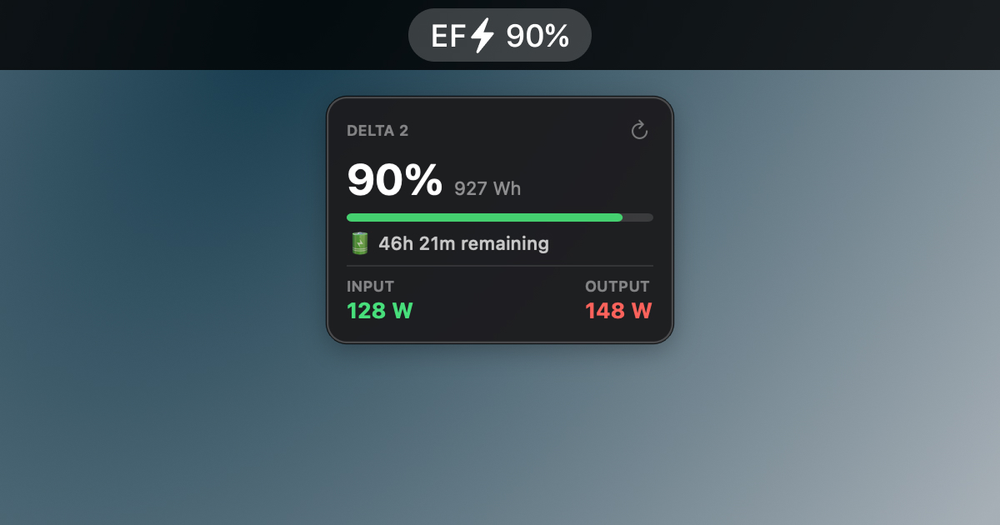

# EFStatus (v2.2.1)

A lightweight macOS menu bar app that shows real-time EcoFlow Delta 2 battery status — no phone app needed, no Node.js, no cloud subscriptions. Ships as a universal binary for Intel and Apple Silicon.



> Running an older version? Compare the number above to the one in **About EFStatus** (right-click the menu bar icon), then re-download from [Gumroad](https://bereto.gumroad.com/l/efstatus) if you're behind.

## What it shows

**Menu bar:** `EF⚡ 89%`

**Popup:**
- Battery % + remaining Wh + visual bar
- Time to full / time to empty
- Live input watts (green) and output watts (red)
- Device model (DELTA 2 / DELTA 3)

SOC is shown as `—` when EcoFlow has not sent a battery percentage (it is not displayed as `0%` unless the device actually reports 0). If the device or API is unreachable, the menu bar and popup show `—` / Lost connection instead of leftover numbers.

## How it works

Starting with v2.0.0, EFStatus connects to EcoFlow's real-time MQTT feed — the same channel used by the official app. Data updates the moment your device reports a change, instead of polling every 10 seconds.

If MQTT disconnects, goes quiet for 30 seconds, or the socket looks half-open (no inbound packets for 90 seconds), the app falls back to REST polling, shows offline honestly when REST also fails, and reconnects in the background. Each reconnect fetches a fresh MQTT certificate from EcoFlow instead of reusing a cached password.

On first launch (and whenever you change keys in Settings), **Save & Connect** checks the Access Key, Secret Key, and device SN against EcoFlow before the window closes. Empty fields still show “All fields are required.” Wrong keys or SN stay on Setup with the API error.

## Compatibility

**Confirmed working**
- EcoFlow Delta 2 ✅ (tested)
- EcoFlow Delta 3 Max ✅ (tested)

**Likely compatible** (same API structure, untested)
- EcoFlow Delta 2 Max
- EcoFlow Delta Pro
- EcoFlow Delta Max
- Delta 3
- Delta Mini
- River 2 / River 2 Pro / River 2 Max
- River Pro

**Not supported**
- PowerOcean, PowerStream — different API
- Delta (1st gen), River (1st gen) — different field names

> If you test EFStatus on a model not listed here, open an issue and let us know!

## Requirements

- macOS 12 or later
- Intel or Apple Silicon Mac
- An [EcoFlow developer account](https://developer.ecoflow.com) with an API key
- Xcode Command Line Tools (`xcode-select --install`) to build from source

## Download & run (no build required)

Get `EFStatus.app` from [Gumroad](https://bereto.gumroad.com/l/efstatus).

1. Download the app
2. Move it to your `/Applications` folder
3. Right-click → **Open** → **Open** (required once to bypass Gatekeeper on unsigned apps)
4. Enter your EcoFlow API credentials in the setup window

## Build from source

```bash
git clone https://github.com/bereto-dev/efstatus.git
cd efstatus
make
open EFStatus.app
```

Build on a Mac (`swiftc` + `lipo`). Linux cannot produce a real `EFStatus.app`.

The first launch opens a setup window where you enter your EcoFlow API credentials. They're saved in `UserDefaults` on your Mac — never sent anywhere other than the EcoFlow API. Access Key, Secret Key, and device SN are shown in plain text in Setup, Settings, About, and Copy Diagnostics on purpose.

## First launch security

Because the app isn't notarized (no Apple Developer account needed), macOS will block it the first time. Right-click → **Open** → **Open** to bypass Gatekeeper once.

## Settings

Right-click the menu bar icon → **Check for Updates…** / **Settings…** / **About EFStatus** / **Quit EFStatus**.

## Credentials

Get your Access Key, Secret Key, and device serial number from [developer.ecoflow.com](https://developer.ecoflow.com).

To update credentials later: right-click the menu bar icon → **Settings…**

Save verifies the keys and SN against EcoFlow before dismissing the window.

## Notifications

EFStatus sends a macOS notification when:
- Input power drops to 0 W (running on battery only)
- Input power is restored after a confirmed outage
- The device goes offline or comes back online

Those first two can be toggled in Settings. If you turn them on but macOS has denied notification permission (or a send fails), EFStatus tells you instead of failing silently.

## Origin

Built by Roberto Pacheco because the EcoFlow Delta 2 doesn't surface consumption statistics in real time — and as his primary office backup power, he needed that data at a glance without picking up his phone.

## Help expand compatibility

If you have an EcoFlow device not listed above and want to help add support for it, run the diagnostic from the app: right-click the menu bar icon → **Copy Diagnostics**, then open a [GitHub issue](https://github.com/bereto-dev/efstatus/issues) and paste the output.

**Copy Diagnostics includes the device serial number on purpose** (along with the raw quota fields). Access Key and Secret Key are not copied.

Or run it from the terminal (this script does **not** print credentials or the serial number):

```bash
curl -O https://raw.githubusercontent.com/bereto-dev/efstatus/main/diag.sh
chmod +x diag.sh
./diag.sh --access-key YOUR_KEY --secret-key YOUR_SECRET --serial YOUR_SERIAL
```

## Changelog

### 2.2.1 — MQTT silence, setup validation, honest stale data
- MQTT watchdog actually fires after the first live message: 30s without PUBLISH falls back to REST; 90s without any inbound packet reconnects
- Lost connection / back online works on the MQTT path, not only REST `catch`
- Reconnect refreshes `/iot-open/sign/certification` instead of looping on a cached MQTT password
- Setup **Save & Connect** verifies keys and SN against EcoFlow before closing; bad or empty credentials stay on the window
- MQTT client: no force-unwrap on port, 1 MB receive cap, teardown-safe receive loop, malformed frames disconnect instead of growing the buffer
- Incremental MQTT updates treat omitted watt fields as 0 when a packet includes any input/output watts (no leftover charger watts)
- REST failures now surface HTTP status instead of looking healthy
- SOC displays `—` when the value is unknown, not a fake `0%`
- Notification permission / send failures are no longer silent if notification toggles are on
- Build number (`CFBundleVersion`) unstuck from `3`; marketing version is 2.2.1

### 2.2.0 — Smarter notifications and bolt icon in popup
- Replaced battery emoji in popup with the bolt SF Symbol used in the menu bar icon
- "No input power" notification now waits 7 seconds before firing — transient blips no longer trigger it
- New notification: input power restored after a confirmed outage
- Both notifications can be toggled individually in Settings

### 2.1.2 — Intel Macs and Gumroad
The downloadable app was Apple Silicon only, so it would not open on Intel Macs. It is now a universal build, and Check for Updates opens [Gumroad](https://bereto.gumroad.com/l/efstatus) instead of GitHub. GitHub is just for source if you want to build it yourself.

### v2.1.1
- Fixed popup getting stuck open when monitors are disconnected or rearranged
- Popup now closes on any click outside it (no need to click the icon again)

### v2.1.0
- New app icon and status bar icon using SF Symbol `bolt.fill`

### v2.0.0
- **Real-time data via MQTT** — EFStatus now connects to EcoFlow's live data feed (the same one used by the official app). Values update the moment your device reports a change instead of every 10 seconds.
- **Automatic reconnection** — if the MQTT connection drops, the app silently falls back to polling and reconnects in the background.
- **Fixed input reading bug** — input watts are now read from the correct fields, preventing the app from showing stale non-zero values after the charger is disconnected.
- **Delta 3 Max support** — device is detected automatically; model name (DELTA 2 / DELTA 3) shown in the popup.

### v1.4.0
- Added "Copy Diagnostics" menu option
- Added refresh button in popup with spin animation
- Fixed popup positioning (4px gap, centered on status bar icon)
- Fixed 0W input bug for Delta 2 (solar vs AC field conflict)

### v1.3.0
- Added About window with origin story and support links
- Added "Check for Updates" menu option
- Added version badge to README

### v1.2.0
- Improved popup design (dark card, color-coded watts)
- Fixed Cmd+V paste in setup window

### v1.1.0
- Fixed SOC accuracy using `bms_emsStatus.lcdShowSoc`
- Fixed UserDefaults crash on first launch

### v1.0.0
- Initial release

## Support

If you find EFStatus useful, you can buy me a coffee ☕

[](https://buymeacoffee.com/bereto)

---

Built with Swift + AppKit. Universal binary (x86_64 + arm64). No external dependencies.
